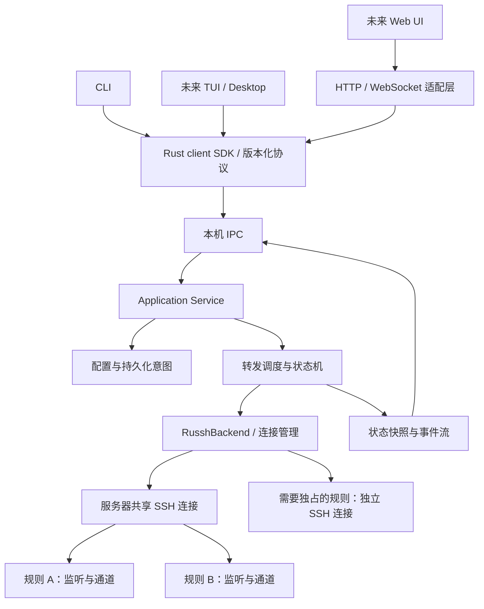

# SSH 端口转发管理器：需求分析与设计提案

创建：2026-09-18；更新：2026-09-20。状态：已实现基于 russh 的首个 CLI 版本；本文同时保留后续增强的设计。已交付功能、运行方法和明确边界以 [README.md](README.md) 为准。

当前实现包括模块化 workspace、L/R/SOCKS5、共享/独占连接、后台与 IPC、重连、配置恢复、原生跳板、主机校验、CLI 和三平台服务适配。Remote 默认启用 verified 回收，包含持久登记、旧会话身份核验、主动终止、重新绑定和 helper 生命周期监督。Linux/macOS 远端均进行真实 OpenSSH 验收；Windows 客户端仍需原生平台运行验收，不能将交叉编译视作运行验证。

用户已确认：使用 Rust 和 russh；第一版为 CLI；同时支持 macOS、Linux、Windows；为 TUI、Web UI、Desktop 保留接口。本文的命令名 `fwm` 为暂定名。

## 1. 产品目标与边界

提供一个面向个人开发环境的、按当前用户运行的 SSH 转发管理器。用户声明需要哪些转发，后台持续维护这些转发；关闭终端不影响运行，网络故障恢复后无需手动重启。

主要场景：

| 场景 | 类型 | 连接路径 |
| --- | --- | --- |
| 本地访问远程 Web、数据库、Jupyter | Local / `-L` | 本地监听 → SSH → 从远端连接目标 |
| 远程服务器访问本地代理、API、开发服务 | Remote / `-R` | 远端监听 → SSH → 从本地连接目标 |
| 本地通过某服务器访问其可达网络 | Dynamic / `-D` | 本地 SOCKS → SSH → 远端连接请求的目标 |

目标地址不限于 SSH 服务器或本机的 localhost，也可以是对应一侧可达的内网地址。Local 的目标主机名在远端解析；Remote 的目标主机名在本地解析。SOCKS 是否把域名交给远端解析还取决于调用方用法。SSH 转发语义见 [OpenSSH ssh 手册](https://man.openbsd.org/ssh)。

管理 TCP 转发；不承诺 UDP、VPN、应用协议代理或已有 TCP 会话的跨断线续传。远端需要可用且允许转发的 SSH 服务；默认 Remote 主动恢复还需 Python 3 和第 6.3 节的平台能力，不要求安装本产品或系统服务、不要求 root。SSH 隧道外侧的最终一段连接是否加密由应用协议决定。

autossh 实际监督一个 SSH 进程，该 SSH 进程可以包含多条转发；其不足主要在于跨服务器、逐规则的持久化管理和统一诊断。我们的差异应落在这些管理能力上。[autossh 官方 README](https://github.com/Autossh/autossh/blob/main/README)

## 2. 需要覆盖的需求

### 2.1 第一版必须满足

| 需求 | 具体行为 |
| --- | --- |
| 多服务器 | 使用服务器名称、SSH 别名、可选标签；按服务器查看和批量操作 |
| 转发管理 | 新增、查看、修改、停止、启动、删除；支持 L/R/D |
| 变更隔离 | 增删或重启一条规则，不中断同服务器或其他服务器的其他规则 |
| 后台运行 | CLI 退出、关闭终端后保持；提供前台 daemon 模式 |
| 故障恢复 | 明确断开后快速尝试；黑洞检测、指数退避、抖动、并发限制 |
| 意图持久化 | 重启恢复运行中的规则；用户停止的规则保持停止；删除规则不会被重试任务复活 |
| 既有 SSH 环境 | 支持 SSH alias、密钥、agent、known_hosts、跳板；明确配置兼容边界 |
| 可解释状态 | 区分连接、监听、目标健康，展示错误、重试次数和下次尝试时间 |
| 易诊断 | `doctor` 检查 SSH 握手、信任、认证、agent、配置冲突；保留脱敏错误 |
| 脚本与未来 UI | 稳定 JSON 输出、退出码、请求/响应协议、事件订阅 |
| 平台集成 | 三平台提供登录自启、前台运行和停止服务的入口 |

### 2.2 容易漏掉但必须设计的情况

- 同一服务器既有正向转发又有反向转发；同一个本地服务可以被多台服务器使用。
- 一台服务器无法连接，不得阻塞其他服务器或 CLI 响应。
- 断网、网络黑洞、Wi-Fi/VPN 切换、电脑休眠，以及服务器重启是不同故障。
- 隧道在线时目标应用可能停止；应用故障不应引发不断重连 SSH。
- agent 的环境和登录 shell 不一致，证书可能过期，硬件密钥可能要求触摸，MFA 可能需要再次交互。
- IPv4/IPv6、通配地址与回环地址重叠可能造成端口冲突；预检存在竞态，以实际绑定结果为准。
- 不同别名可能指向同一服务器；远端冲突不能仅靠本地配置完全预测。
- 反向转发的旧服务端会话可能仍占端口；这是恢复流程的一部分。
- daemon 崩溃、多个 CLI 同时修改、删除与重试同时发生，都不能产生重复实例或丢失配置。
- 固定端口被占用时不能静默换端口，避免调用方继续使用旧地址。
- 同步到第二台电脑的反向规则可能争抢同一远端端口，因此首版不做配置自动同步。

## 3. 总体架构



一个安装包、一个主要可执行文件 `fwm`，按子命令执行 CLI 或 daemon。每个操作系统用户一个 daemon，使用实例锁和 IPC 握手解决并发启动。daemon 内的 Tokio 任务负责本地 TCP 与 russh 通道间的双向数据搬运，数据不经过 CLI 或管理 RPC；客户端运行基础转发不依赖系统 ssh 可执行文件。远端继续使用兼容的 OpenSSH 服务端。

建议 Rust workspace 初始保持三个 crate，避免过早拆分：

- `fwm-core`：模型、校验、Application Service、调度器、状态机、存储接口、SSH 后端接口；不依赖 CLI 展示层。
- `fwm-api`：版本化消息、错误类型、事件类型及 client SDK。
- `fwm`：CLI、daemon 启动、平台适配与依赖装配。

core 内部按 `model / engine / backend / storage` 分模块。未来界面通过 SDK 调用现有 daemon，不各自启动独立的转发引擎。

异步运行与网络 I/O 选 Tokio，SSH 协议选 russh，CLI 选 clap，序列化采用 Serde，配置采用 TOML，诊断采用结构化日志。具体依赖版本及加密后端在实现阶段锁定并纳入三平台 CI；Rust 协议实现不意味着加密依赖一定没有原生编译步骤。[russh 文档](https://docs.rs/russh/latest/russh/)、[clap 文档](https://docs.rs/clap/latest/clap/)

## 4. 已确定的 SSH 后端：russh

采用 `RusshBackend` 在 daemon 内直接建立 SSH 连接，通过类型化 API 获取认证、通道、转发请求和断开结果。连接复用由本产品管理，不依赖系统 OpenSSH 的 ControlMaster，也不解析子进程 stderr 判断就绪。[russh 客户端 API](https://docs.rs/russh/latest/russh/client/struct.Handle.html)

### 4.1 连接与规则的所有权

默认同一服务器 profile、相同连接配置的规则共享一条 SSH 传输连接。`ConnectionKey` 包含 profile ID、主机/端口/用户、跳板链、凭证引用、信任策略、连接配置版本和隔离 scope；shared 的 scope 为 profile ID，dedicated 的 scope 必须包含 rule ID，确保连接去重不会合并独占规则。不同 profile 不因 IP 相同而自动合并。`connection_mode = "dedicated"` 可让单条规则独占连接；Remote 启用 `remote_cleanup = "verified"` 时强制独占，以满足第 6.3 节的回收隔离要求。

连接管理任务拥有 russh handle、连接任务、认证、心跳与重连策略；每条规则拥有自己的监听、转发注册状态和数据通道集合。`SshBackend` 保留领域级操作边界，首版只实现 russh 后端。每个 ConnectionKey 同时最多一个连接尝试；同一连接故障由连接管理器重试一次，避免每条规则各自建立替代连接。

正常增删规则只操作相应监听和通道。共享传输本身断开会影响其全部规则，连接恢复后逐条重新注册；一条 Remote 规则端口冲突时，其他成功规则仍可使用。单条 retry 在健康共享连接上只重试该规则，不重启整条传输。修改服务器的认证、信任或跳板配置会影响共享它的规则，应在应用前列出影响范围。

首版面向个人开发中几十条规则的规模，限制连接尝试、每规则活动连接、待处理通道及缓冲大小，并测试反压和双向半关闭。每条数据通道独立运行搬运任务；Handler 回调不执行长期数据复制或无限等待本地 target，以免拖住整条 SSH 连接。

### 4.2 转发创建、取消与就绪证据

| 类型 | 建立方式 | 停止方式 |
| --- | --- | --- |
| Local | Tokio 绑定本地监听；每个接受的 TCP 连接调用 `channel_open_direct_tcpip` 并双向搬运 | 关闭该规则监听及其活动通道 |
| Remote | 调用 `tcpip_forward`，由 `server_channel_open_forwarded_tcpip` 回调接收远端连接，并连接本地 target | 调用 `cancel_tcpip_forward` 确认取消，同时关闭该规则活动通道 |
| Dynamic | 绑定本地 SOCKS5 入口，完成 SOCKS CONNECT 协商后按请求目标创建 direct-tcpip 通道 | 关闭该规则 SOCKS 监听及其活动通道 |

首版 SOCKS 仅实现 TCP CONNECT；域名请求交由远端解析，IP 请求保持调用方指定的地址。不承诺 SOCKS UDP ASSOCIATE 或 BIND。

Local/Dynamic 的 Established 要求本地监听成功且 SSH 已认证；Remote 要求 SSH 已认证且服务端确认监听注册成功。协议确认不等于目标应用健康，也不证明 Remote 的实际暴露范围。Local/Dynamic 在传输重连期间可保留本地监听以避免端口被抢占，但应快速拒绝新业务连接并显示恢复中，不无限缓存或假报可用。

每个共享连接串行管理远端监听的创建/取消请求，按连接代、规则代和监听端点记录操作。CLI 等待超时仅结束前台等待，后台仍追踪协议结果。已经发送的请求不能因 Future 被丢弃就认为远端撤销；删除期间迟到的创建成功结果必须触发补偿取消，不能直接当旧事件忽略。取消未确认时保留端点占用记录并报告 Stopping/Unverified，拒绝路由到已停止规则，也不立即复用该端点。

为确认单条取消结果，不主动断开其他规则仍在使用的健康共享连接。只有传输本身失败、最后一个使用者退出或显式整组重启时，才关闭共享连接。逐条停止默认同时关闭该规则已有数据连接；仅取消监听并不会自动结束已有通道。

若已发送的远端控制请求长期无回复但现有数据通道仍可用，连接标记 control_degraded。暂停后续依赖该回复顺序的远端变更，并立即向对应操作返回明确的阻塞原因/待处理状态，不能让后续 CLI 无期限挂起；保持已有数据通道和本地停止能力。迟到回复经对账后可恢复控制队列，或由用户显式执行连接组重启；单条超时不自动升级为破坏整组连接的重启。

远端回调只接受属于当前连接和已注册规则的目标端点；拒绝未知端点。注册确认前的早到回调、停止时的在途回调均须以有界队列和规则状态处理，避免误路由到同端口的新规则。绑定、远端确认和通道打开的错误保留结构化阶段，不依赖延时或日志文案推断成功。

### 4.3 SSH 配置、信任与认证边界

`fwm server add --ssh alias` 通过配置适配层读取 SSH 别名。首版明确支持并测试 `Host`、受限 `Include`、`HostName`、`User`、`Port`、`IdentityFile`、`IdentitiesOnly`、`IdentityAgent`、`UserKnownHostsFile`、主机校验策略及 `ProxyJump`；配置优先级、路径、Host 通配和 Include 循环需要测试。可复用 russh-config 等解析工具，但必须验证其覆盖范围。也支持直接填写 host/user/port 等 profile 字段，不要求用户安装 ssh 命令。

超出支持范围且会改变选中主机连接、认证或信任语义的配置，应明确拒绝或要求转换为显式 profile，不静默忽略。首版不执行任意 `ProxyCommand`、`Match exec` 或 LocalCommand；复杂动态配置与任意 SSH config 完全兼容留到后续。有效别名中已有 L/R/D 指令时，要求显式迁移成受管规则，不隐式创建重复转发。`doctor` 展示实际采用的配置和不支持的项目。

`ProxyJump` 使用 russh 通道承载下一跳 SSH 握手，每跳独立验证主机密钥和认证；限制跳数并检测循环。跳板连接归所属 ConnectionKey 管理，首版不额外跨组复用跳板，以简化退出与故障传播。

通过 `Handler::check_server_key` 等入口实现 known_hosts/固定指纹信任策略。默认验证后才发送用户认证凭证；未知主机进入待确认，密钥变化进入 NeedsAttention。`fwm server trust` 展示主机、算法和指纹并由前台用户明确确认；后台不无条件接受首次出现的密钥。必须测试非标准端口、哈希 known_hosts 和拒绝已撤销密钥；未实现的 CA/主机证书信任形式应报不支持，不能当作校验成功。[russh Handler](https://docs.rs/russh/latest/russh/client/trait.Handler.html)

首版支持普通私钥及 ssh-agent 签名，按平台验证 Unix agent socket 与 Windows OpenSSH agent 接口；其他 agent、硬件密钥、证书和交互认证按能力报告。加密私钥优先由用户已解锁的 agent 使用；需要口令/MFA/触摸时显示 NeedsAttention，不把凭证写入配置。系统级 agent 兼容和远端限制需要真实测试，不能以库具备认证 API 代替产品已支持的承诺。

### 4.4 选型依据（2026-09-20）

在比较底层协议实现的维护、安全修复、实际采用，以及 Rust 封装的功能覆盖后，用户已确定使用 russh。选择理由是 Tokio 集成、直接的通道控制和跨平台动态转发接口；维护与兼容风险由锁定依赖、持续升级和场景测试控制。下面保留其他路线的主要取舍，供未来评估参考。

| 候选 | 已确认的能力与依据 | 本项目需要验证的成本 |
| --- | --- | --- |
| `ssh2` / `ssh2-rs` + libssh2 | L/R、agent、非阻塞模式；libssh2 被 curl、libgit2 用作 SSH 后端 | Session 的通道共享内部锁，需正确的非阻塞会话驱动；Listener Drop 取消监听忽略返回值，非阻塞取消完成需验证/补接口；三平台原生依赖打包 |
| `libssh-rs` + libssh | L 的 open_forward，R 的 listen_forward/accept_forward；WezTerm 有实际依赖 | 当前安全封装缺少显式远端监听 cancel 方法，可能需要扩展绑定；需要异步适配和原生构建；Rust 包 MIT、底层 libssh LGPL，分发时分别核对许可证 |
| `openssh` crate | 封装系统 OpenSSH，提供异步 L/R 创建和关闭 | 官方仅支持 Unix、依赖 ControlMaster，不适合三平台统一后端 |
| `russh` | Rust/Tokio 协议实现，通道与转发 API 直接；有持续发布和安全修复 | 配置/agent/跳板集成、版本升级及异常协议和弱网回归测试 |

转发及非阻塞依据：[ssh2 Session](https://docs.rs/ssh2/latest/ssh2/struct.Session.html)、[ssh2 Listener 源码](https://docs.rs/ssh2/0.9.6/src/ssh2/listener.rs.html)、[libssh2 取消接口](https://libssh2.org/libssh2_channel_forward_cancel.html)、[libssh-rs Session](https://docs.rs/libssh-rs/latest/libssh_rs/struct.Session.html)、[openssh 文档](https://docs.rs/openssh/latest/openssh/)。

实际采用依据：[curl 依赖说明](https://curl.se/docs/libs.html)、[libgit2](https://github.com/libgit2/libgit2)、[WezTerm SSH 依赖](https://github.com/wezterm/wezterm/blob/main/wezterm-ssh/Cargo.toml)。这些能证明实际应用经历，但不能替代本产品的多转发并发与故障恢复测试。

`async-ssh2-tokio` 当前底层是 russh，并非另一套独立协议栈；`async-ssh2-lite` 属于 ssh2/libssh2 的异步封装路线，要额外评估包装层维护和行为。[async-ssh2-tokio 依赖](https://docs.rs/crate/async-ssh2-tokio/latest)、[async-ssh2-lite 仓库](https://github.com/bk-rs/ssh-rs)

russh 的最小验证项是三平台编译与认证、多规则双向并发、单独删除远端监听、黑洞检测、反复重连及资源回收。第一版不并行实现其他完整后端。

## 5. 领域模型与持久化

| 模型 | 关键字段 |
| --- | --- |
| `ServerProfile` | 稳定 ID、名称、SSH alias 或显式地址、配置文件路径、标签、连接策略 |
| `ConnectionRuntime` | ConnectionKey、connection_generation、连接/认证状态、引用规则、心跳、连接级退避 |
| `ForwardSpec` | 稳定 ID、名称、group、server_id、Local/Remote/Dynamic、监听地址、目标地址、desired_state、connection_mode、remote_cleanup |
| `RetryPolicy` | 心跳、连接超时、重试基数、最大间隔、稳定期、并发限制 |
| `ForwardRuntime` | observed_state、rule_generation、关联连接代、监听注册/取消状态、通道集合、最后错误、规则级退避、时间戳 |
| `HealthStatus` | unknown/healthy/unhealthy、探测方式、检测时间；与连接状态独立 |

方向应使用带数据的枚举表达；Dynamic 没有固定 target，避免允许无意义字段组合。

配置存 TOML，包含 schema_version 和配置 revision；观测状态保存在内存，历史事件写有界日志。首版不需要 SQLite、分布式协调或插件系统。

示例为拟议格式，名称可读，内部使用稳定 ID：

```toml
schema_version = 3
revision = 1

[defaults.retry]
keepalive_interval_secs = 5
keepalive_max = 3
connect_timeout_secs = 10
max_delay_secs = 30
stable_reset_secs = 60

[[servers]]
id = "server-dev"
name = "dev"
ssh_alias = "my-dev-server"

[[forwards]]
id = "forward-dev-web"
name = "dev-web"
server_id = "server-dev"
kind = "local"
listen = "127.0.0.1:3000"
target = "127.0.0.1:3000"
desired_state = "running"
connection_mode = "shared"

[[forwards]]
id = "forward-local-proxy"
name = "local-proxy"
server_id = "server-dev"
kind = "remote"
listen = "127.0.0.1:17890"
target = "127.0.0.1:7890"
desired_state = "running"
connection_mode = "dedicated"
remote_cleanup = "verified"
```

在线时 daemon 为唯一写入者：校验请求与 revision → 原子持久化新意图 → 调度差量变更 → 返回 operation/revision → 异步报告实际结果。后台停止时，仅停用和删除操作可在取得同一个 daemon 实例锁后离线提交，不创建后台或唤醒其他规则。磁盘写失败不得报告配置成功；网络建立失败不撤销已保存规则，而是显示实际失败与重试状态。

CLI 命令提交成功意味着期望状态已持久化，不等于监听已建立；需要后者时使用 `--wait`。批量配置验证全有或全无，但多个远端实际连接不能承诺分布式原子成功，返回逐项结果。

`up/down` 持久改变规则意图；`daemon stop` 仅停止后台运行，不把所有规则改成 stopped。再次启动 daemon 会恢复 running 规则。修改规则的监听、目标或所属服务器需要重建该规则的监听/通道，会断开该规则上的现有连接，不断开其他规则使用的共享连接；修改名称等元数据不重连。服务器连接配置变更则按第 4.1 节处理整个受影响连接组。

手工编辑通过 `config reload` 显式校验和应用，首版不自动监听文件。将人工编辑文件视为候选输入，另外维护 daemon 专有的最后有效配置快照；每次成功提交以可恢复的原子步骤更新快照与 revision。候选文件无效时保留当前有效运行状态，重启后仍可从有效快照恢复并明确报告配置错误，不静默采用坏文件。支持 `config validate/export`。服务器仍被规则引用时拒绝删除并列出引用；批量删除需要明确选项。

停用、启动及删除不被未完成草稿阻止：针对所选资源的控制意图与 applied 快照同一次原子写入，草稿原文保留，之后 reload 合并这些意图以防旧草稿复活规则。配置版本 3 保存规则 group；旧版本符合 `名称-源端口` 的多成员且前缀无名称冲突时迁移为同名组，成员 ID 保留。

在线与离线操作共用纯配置变更校验；离线写入持有与 daemon 相同的实例锁，并校验 revision。禁用新增、普通编辑、服务器管理及 reload 不启动后台；有效的启用命令在提交后才启动。离线 reload 直接提交候选配置，避免短暂启动旧规则。缺少 ID 的手写配置按类别和名称获得稳定初始 ID，显式 ID 和已持久化对象身份不变。

## 6. 自动恢复与状态机

```text
Stopped --up--> Starting --已确认建立--> Established
                   |                        |
                   +----可重试错误----------+
                              |
                           Backoff --定时/网络恢复/retry--> Starting

Starting --明确需要用户处理--> NeedsAttention --修复/retry--> Starting
任意状态 --down/remove--> Stopping --> Stopped/Removed
```

上述为规则状态机；连接管理器另维护连接/认证/退避状态，并向依赖规则传播传输故障。取消结果等无法确认时标记 Unverified/cleanup_pending；目标健康单独记录，不把应用 unhealthy 等同于 SSH 断开。连接尝试按 ConnectionKey 去重，规则注册/取消由连接管理器串行监督。

配置 revision、connection_generation、rule_generation 分开：名称等元数据修改只递增 revision；连接重建更新连接代；影响监听、目标、启停意图或删除的变更更新规则代。事件携带相应代次，旧任务不得复活已删除规则，但已发送且迟到成功的操作仍需按第 4.2 节补偿清理。仍有效的连接不会因改名失去事件处理。

### 6.1 “即时”的可测定义

- 收到 russh 连接任务结束、I/O 错误或明确断开后，无需等待固定轮询周期；目标是在故障事件进入调度器后 1 秒内安排第一次尝试。资源排队时间单独展示。
- 黑洞初始配置为 russh `keepalive_interval=5s`、`keepalive_max=3`。锁定版本在计数超过阈值时关闭连接，本机关闭服务端心跳的纯黑洞测试实测约 20.1 秒，不能按参数乘积承诺 15 秒。实际行为还受调度、负载和睡眠影响；发送心跳成功不代表收到回复。
- 连接建立设置独立截止时间，覆盖 DNS、TCP、每跳握手和认证；转发注册/取消与业务通道打开另有操作期限。超时不等于远端回滚。保持长期空闲转发可用，不把应用无流量当作断线；`inactivity_timeout` 不代替心跳检测。
- 首次快速尝试后，以约 1、2、4、8、16、30 秒的指数退避加入有界抖动，最终间隔不超过 30 秒。可重试网络错误持续恢复，直到用户停止。
- 网络恢复和唤醒事件提前触发尝试并去重；周期性重试作为兜底。稳定运行 60 秒后才重置失败计数，避免频繁抖动持续走“首次立即”。
- 初始建议全局最多 8 个、每服务器最多 2 个并发连接尝试；均可配置。网络事件不能绕过认证限流或使所有规则无限重试。

上述数字是待验收的默认策略，不是已经测得的性能指标。心跳和连接回收参数语义以 [russh Config](https://docs.rs/russh/0.63.3/russh/client/struct.Config.html) 为准；升级依赖时回归验证静默黑洞、写阻塞和长期空闲场景。

恢复时延 = 发现故障 + 排队/退避 + DNS/连接/认证 + 监听恢复。不能承诺任何网络条件下零秒恢复。旧应用 TCP 连接中断后需要应用自行重连，本产品恢复的是监听和新连接能力。

### 6.2 按错误类型处理

| 错误 | 默认行为 |
| --- | --- |
| 断网、暂时 DNS 失败、超时、SSH 连接任务异常结束 | 由连接管理器自动重试并记录阶段，恢复后重新注册 running 规则 |
| 明确认证失败、主机密钥变化、缺少凭证 | NeedsAttention；停止高频尝试，修复后 retry |
| 本地监听占用 | 显示冲突；保持运行意图，低频检查/重试或手动 retry；不擅自换端口 |
| 远端转发请求被拒绝 | 可能是端口滞留、权限或冲突；缺少证据时保留不确定性，限速重试并提示检查 |
| SSH 建立但目标服务失败 | 维持隧道；若有探测，更新目标健康；不默认重启 SSH |
| 配置语法错误、确认的不支持算法/认证/配置功能 | 等待修复，不盲目启动循环 |

Remote 特别边界：旧 sshd 会话可能在客户端已断线后继续持有远端监听。默认 verified 模式通过新的 SSH 连接主动回收已确认属于本管理器、同一规则的旧独占会话；显式 off 模式才等待服务端清理。有权限时也可配置服务端 `ClientAliveInterval/ClientAliveCountMax` 缩短残留时间。[sshd_config](https://man.openbsd.org/sshd_config)

### 6.3 远端残留会话主动回收

新 SSH 已可连接、但旧反向转发仍占监听端口时，主动终止旧会话可以缩短恢复时间。目标是持有监听的旧 SSH 会话进程，不能误杀 SSH 主服务、目标应用或其他用户会话。终止会话会中断其全部通道，因此只对已确认独占该规则的会话自动执行。[OpenSSH 服务端会话模型](https://man.openbsd.org/sshd)

提供 `off / verified` 策略；新反向规则默认 verified，旧版本反向规则也会迁移启用。verified 需要远端允许执行受控命令并通过平台和权限探测，实际始终使用 dedicated 连接。注册/helper session 也在同一独占连接上建立。实现 Linux 和 macOS 远端适配；不支持的远端返回明确错误，用户可显式选 off。只有关闭主动回收的规则才可共享连接。

1. 建立正常转发时注册所属设备/管理器 ID、规则 ID、运行代与随机会话标识，关联远端用户、主机启动身份、实际会话进程及其创建时间。仅知道端口、进程名或 PID 不足以证明归属。
2. 本地确认旧实例已停且不再重试，通过不申请该冲突端口的新 SSH 管理连接检查远端记录与实际监听归属。
3. 对同一规则串行回收，确认目标仍为旧运行代，并在发信号时防止 PID 复用竞态；Linux 可评估 pidfd 等进程身份机制。已启动的新实例或另一设备的规则不得被旧任务回收。
4. 先请求旧会话退出或发送 TERM；限定等待后仍未释放时，只有继续确认同一目标和权限才允许 KILL。等待监听实际释放，再重建并注册新实例。
5. 没有本规则归属记录且端口被占用时，不终止占用者，报告冲突并退避；身份不符、权限不足或能力不支持时进入 NeedsAttention。禁止按端口强杀或自动提升权限。

russh 在转发所在的独占 SSH 连接上另开 session channel 执行内置 Python helper，通过 claim→SSH 监听确认→confirm 建立可信归属记录，按需运行且不安装系统服务。Linux 用 pidfd 固定信号目标；对于降权 sshd 的不可读 fd，使用原受信 exec 的祖先关系、出生身份和传输 inode 证明已登记会话，不能以同 UID 代替归属。监听 inode 来自同一连接转发请求成功后的确认；若 confirm 回复丢失，claim 已登记的专用会话仍可验证并关闭，随后独立检查端口。helper 意外退出由引擎监督并触发独占连接恢复。

只结束远端 shell/helper 不保证释放转发；SSH 转发通道独立于 shell session。回收必须确保实际持有监听的旧连接终止并验证端口释放。新连接的取消转发请求也不能用来接管或取消另一条旧连接的监听。[SSH 连接协议 RFC 4254](https://www.rfc-editor.org/rfc/rfc4254.html#section-7)

是否需要 sudo 取决于实际持有监听的进程身份和服务端实现。在常见 Linux 配置中，同一用户可能有权限终止对应的用户态会话进程；不能因为登录用户相同就假设能终止所有 sshd 相关进程。[Linux kill 权限说明](https://man7.org/linux/man-pages/man2/kill.2.html)

## 7. CLI 体验

```sh
# 使用已有 SSH 别名，避免重复填写密钥与跳板
fwm server add dev --ssh my-dev-server
fwm server trust dev

# 日常添加可直接使用 SSH 别名；自动创建服务器记录并命名规则
fwm add --server example-cluster --remote --src 12222 --tgt 22
fwm add --server example-cluster --local --port 3000

# 本地访问远程 Web：默认本地回环监听
fwm add dev-web --server dev --local 3000:127.0.0.1:3000

# 远端 17890 访问本地 7890
fwm add local-proxy --server dev --remote 17890:127.0.0.1:7890

# 本地 SOCKS 入口，经 dev 访问目标
fwm add dev-socks --server dev --dynamic 1080

# 单端口或范围：目标侧 localhost 的同名端口
fwm add web --server dev --local --port 3000
fwm add ports --server dev --remote --port 3000-3003,8080

# 多个源端口转发到同一个目标端口
fwm add pooled --server dev --local --src 3000-3003 --tgt 8080

fwm status
fwm status --watch
fwm status --json
fwm edit dev-web --local 3000:127.0.0.1:3001
fwm down dev-web
fwm up dev-web --wait --timeout 20s
fwm retry local-proxy
fwm restart local-proxy --wait
fwm restart --server dev --wait
fwm up --server dev
fwm down --server dev
fwm remove dev-web
fwm logs local-proxy --follow
fwm doctor --server dev

fwm config validate
fwm config reload
fwm config export
fwm daemon run
fwm daemon start
fwm daemon stop
fwm daemon restart
fwm service install --user
fwm service uninstall --user
```

`add` 默认保存并启动；`--disabled` 仅保存。`up/restart` 在校验选择范围和配置后按需启动 daemon，失败请求不唤醒其他规则。查询、检查、信任和离线编辑不启动 daemon。纯查询在 daemon 不在线时仍能报告“后台未运行”和已保存规则。短端口写法默认绑定 127.0.0.1，IPv6 使用明确括号语法。

日常 add 不要求预先 server add 或提供规则名：`--server` 始终必填，可直接引用 SSH 别名，不存在的服务器与转发在同一次配置事务中创建。即使只有一个已保存 profile 也不推断服务器。规则名可用 `--name` 指定，旧位置名称兼容；省略时随机选取一个简短英文单词，并避开规则名称、ID、组名及当前批次的重复项。方向参数不能吞掉位置名称；完整映射使用等号明确关联，兼容层只识别确为映射/端口的旧空格写法。

`--port` 接受单端口、闭区间及逗号组合，每个源端口映射到目标侧 `localhost` 的同名端口；`--src` 接受相同的集合语法，`--tgt` 是统一的单个目标端口。创建时 src/tgt 成对，编辑时则只修改给出的字段。多端口添加保存 group，成员用 `名称-源端口`；组可用名称或 `--group` 查询、启停、重启、删除，也可以原子批量编辑目标或服务器。编辑不会增加监听数量，源端口冲突导致整组变更失败。所有批量配置变更只提交一次。

`add --group GROUP` 显式支持一个或多个成员加入组，`--name` 独立决定名称或批次前缀。编辑的 `--local=PORT/--remote=PORT` 与 `--port` 一致保留地址；同组监听冲突无论成员是否运行都在保存前拒绝。服务器 `--unset` 删除字段覆盖、恢复继承，`--proxy-jump none` 明确禁用跳板。信任成功后自动恢复受该信任对象影响的阻塞规则，保留健康和已停止规则；doctor 报告候选配置错误和未应用草稿。

常规命令准确区分已保存、已停止及连接中的意图；`--wait` 等待实际监听建立，超时不删除规则或停止后台恢复。一次性 JSON 命令只输出一个最终结果，失败可同时标记配置已保存，避免先报成功再报失败。`restart` 重建选中的规则，停止规则先持久启用；`retry` 只重试异常运行规则，并返回实际操作和跳过清单。`status/logs` 使用相同的名称/组/服务器选择方式，状态显示完整双端地址和保存意图。

CLI 日志读取持久历史，与后台是否在线无关。每条历史事件携带当时的规则名、稳定 ID、服务器和 group，重命名或删除后仍可追溯；旧格式无标签记录尽量补全并报告无法还原的部分。默认 tail 100，支持 UTC 日期、轮转跟随和跨后台实例去重。非 follow JSON 返回一个包含事件数组与警告的对象。

示例状态：

```text
NAME         SERVER  STATE         INTENT   RETRY
dev-web      dev     established   running  —
  local 127.0.0.1:3000 -> remote localhost:3000 (0 active)
local-proxy  dev     backoff       running  4s
  remote 127.0.0.1:17890 -> local localhost:7890 (0 active)
dev-socks    dev     stopped       stopped  —
  local 127.0.0.1:1080 -> remote SOCKS5 destinations (0 active)
```

`established` 只表示取得 SSH/监听成功证据，不代表目标应用健康。Local/SOCKS 使用 SSH 转发通道；Remote 默认的 verified 回收模式会执行远端 helper，核验并清理旧独占会话。后续可增加明确配置的 HTTP 或协议探测；反向转发端到端探测需要能从远端入口发起，单测本地 target 不能冒充整条链路健康。

退出码区分参数/配置错误、认证或信任需要处理、等待超时、daemon/IPC 故障；JSON 使用稳定错误码而非依赖人类文案。帮助、shell 补全、错误中的修复建议属于 CLI 交付的一部分。

## 8. 后台运行与平台差异

| 平台 | 本机 IPC | 登录自启 |
| --- | --- | --- |
| macOS | 用户私有目录中的 Unix domain socket | LaunchAgent |
| Linux | 用户运行目录中的 Unix domain socket | systemd 用户服务；没有 systemd 可前台托管 |
| Windows | 仅当前用户、本机可访问的 named pipe | 当前用户登录触发的计划任务 |

统一承诺“关闭终端继续运行、登录后可自动启动”。“用户未登录也开机运行”涉及不同权限与 agent 环境，后续单独提供系统服务模式。[Apple LaunchAgent](https://developer.apple.com/library/archive/documentation/MacOSX/Conceptual/BPSystemStartup/Chapters/CreatingLaunchdJobs.html)、[Windows 计划任务](https://learn.microsoft.com/en-us/windows-server/administration/windows-commands/schtasks-create)

服务安装显式执行；普通 add 只拉起当前用户后台，不默默设置永久自启。已由系统服务托管时，`daemon start/stop/restart` 通过平台适配器操作该服务；手动 stop 必须抑制当前会话的自动重启，不能只杀进程后立刻被 KeepAlive/Restart 拉起，也不移除下次登录自启配置。restart 复用停止和启动流程，等待 IPC 与实例锁都释放后再启动，不修改规则启停意图；原本停止时也可直接启动。下一次显式 start 或用户登录可以恢复。基础连接使用内置 russh；`doctor` 报告库版本、配置/信任问题及可用认证方式。

后台使用的 ssh-agent 环境必须有明确来源和更新入口：在当前 CLI 用户身份下更新/重试，显示实际 agent 可用性，避免把一次启动时已经失效的 socket 永久保存。证书过期、MFA、硬件密钥等需要交互的场景显示 NeedsAttention，首版不保存明文密码、不承诺无人干预完成 MFA。

正常停止先取消重试与接入，再停止本地监听、取消远端监听、关闭规则通道，最后断开 SSH 并等待连接和搬运任务退出；设置总退出期限，超时显式中止自有任务并释放 socket。引用其他规则的共享连接只在整组退出时关闭。

daemon 强制崩溃时，操作系统回收本进程的本地 socket；基础模式没有本地 SSH 子进程需要回收。远端仍可能未及时察觉断线，按第 6.2/6.3 节恢复。重启创建新的 daemon_instance_id 与连接代，不把缓存的远端 PID 当作可直接终止的授权。首版原生 ProxyJump 也不生成代理子进程。

## 9. 未来 UI 的接口

首版本机 IPC 采用长度前缀 JSON 帧，请求包含 api_version、request_id、method、params；限制帧大小和事件队列长度。协议不依赖 CLI 文案，错误包含稳定 code、可重试标志、作用对象和可读详情。

建议操作：`server.list/put/remove/check/trust`、`forward.list/put/remove/set_desired/retry`、`status.snapshot`、`events.subscribe`、`logs.tail`、`doctor.run`。trust 请求必须绑定刚展示给用户的主机身份与指纹，不能在后台把另一把新密钥代入先前确认。带副作用请求支持幂等 request_id 或稳定资源 ID，配置修改可携带 expected_revision，冲突返回明确错误。

事件包含 daemon_instance_id、递增 sequence、资源 ID、connection_generation/rule_generation、时间戳及变更。快照与其 sequence 在同一状态边界产生；客户端用 `subscribe(after_sequence)` 从有界事件缓冲接续，避免先快照后订阅期间漏事件。所需序号已被淘汰或 daemon_instance_id 改变时明确返回 resync_required 并重新获取快照；慢订阅者不会阻塞转发状态机。

以上订阅与 generation 字段是后续增量 UI 的目标契约。当前 CLI 使用轮询：`status_view` 在同一应用锁内返回配置及运行快照，并支持服务端选择；`events` 使用后台实例及 sequence 分页。事件的时间和资源标签在产生时捕获，journal 只分配该实例的消费序号。当前状态快照还未携带事件游标，不能视为已经实现可续接的原子“快照＋订阅”。

TUI 和 Desktop 使用同一 SDK。Web UI 增加 HTTP/WebSocket 适配，不重写配置和恢复逻辑；认证、Origin 检查和远程访问策略在 Web 阶段实现，首版不额外开放管理 TCP 端口。

## 10. 安全与可观测性

- 监听地址默认请求回环；对外暴露必须在规则中明确配置，不自动开放防火墙。
- Remote 的实际绑定受服务端 `GatewayPorts` 控制，`yes` 可强制通配监听，不能声称客户端写 127.0.0.1 就绝对限制远端暴露范围；有权限且需要客户端选择地址时使用 `clientspecified`。[sshd_config](https://man.openbsd.org/sshd_config)
- 后台实施主机密钥校验；首次信任通过 `fwm server trust` 前台交互明确完成。密钥变化进入待处理，不自动绕过验证。
- 配置只保存密钥路径或 agent 引用；日志不记录密码、私钥、令牌或完整环境。详细 SSH 日志也需滚动、限额和脱敏。
- Unix IPC 与配置目录只允许当前用户访问。Windows pipe 显式设置当前用户 DACL、拒绝远程访问，不依赖默认权限。[Microsoft pipe 权限](https://learn.microsoft.com/en-us/windows/win32/ipc/named-pipe-security-and-access-rights)、[named pipe 概述](https://learn.microsoft.com/en-us/windows/win32/ipc/named-pipes)
- 每条规则记录最近失败阶段、重试次数、下次尝试、最近建立时间。日志按规则筛选并有大小/时间上限，重复错误合并。
- 内置搬运任务可记录活动通道和传输字节用于资源诊断；字节统计口径明确为应用数据，不冒充 SSH 加密线上流量。详细流量展示与应用延迟探测后续再做。

## 11. 开发顺序与验收

### 阶段 A：先验证后端可行性

在三平台编译并运行 russh 客户端，对接真实 OpenSSH 服务端验证 L/R/D、支持的 SSH alias、单跳和多跳、主机校验、非交互认证和 agent。重点验证同一 SSH 多规则并发、远端创建/取消确认、迟到回复、回调路由、反压/半关闭和正常退出清理。

根据锁定版本的实际 API 行为完善连接管理器；弱网与写阻塞不能拖死心跳或控制请求。若注册/取消结果无法确认，应报告未确认状态，不用固定 sleep 冒充已建立或已删除。

### 阶段 B：实现可用闭环

领域模型、配置、单实例 daemon、本机 IPC、CLI、连接管理器与逐规则任务、取消与两级 generation、退避、错误分类、状态和日志。完成真实断网恢复以及并发增删测试。

### 阶段 C：完成首版产品

三平台登录自启与打包、doctor、agent 环境处理、批量操作、JSON 与 SDK、帮助补全、日志限额和故障恢复回归。A/B 是工程里程碑，完成 C 才满足本文第一版交付范围。

### 验收矩阵

| 场景 | 验收标准 |
| --- | --- |
| 三平台 L/R/D | 经真实转发完成请求与响应；验证两侧目标地址语义 |
| 同服务器和跨服务器多规则 | 删除/新增/停止一条不打断其它规则的既有长连接 |
| 连接任务结束、远端会话终止、TCP reset | 自动恢复新连接，无重复连接尝试；记录发现和首次调度时间 |
| 静默丢弃网络流量、写阻塞 | daemon 仍活着时也能发现黑洞；按预算恢复 |
| 休眠唤醒、VPN/网络切换 | 自动恢复，无高频空转；计入网络事件与兜底定时器 |
| 目标应用停止后再启动 | 不因应用失败无谓重启 SSH；未检测时不报告健康 |
| 本地端口冲突、远端拒绝、旧会话滞留 | 不假报成功、不擅自换端口、采用适当重试并提示原因的不确定性 |
| 主动回收：已验证旧会话、陌生占用、PID 复用、跨设备冲突 | 只回收属于本管理器且已被替代的旧独占会话；外部占用退避，无法核验身份则进入待处理 |
| agent 锁定、主机密钥变化、禁止转发 | 不绕过安全验证，不形成认证风暴 |
| daemon 强制终止与重启 | 本地 socket 回收，远端残留按策略处理，无重复监听和误杀 |
| 关闭终端、注销再登录 | 行为符合当前用户后台和登录自启语义 |
| 重连中 remove/down、并发 CLI 修改 | 删除不复活；停止意图持久化；revision 冲突明确 |
| 创建成功迟到、取消响应超时、端点重新使用 | 补偿取消不遗漏；不假报释放；旧回调不进入新规则；不为了单条取消断开健康共享连接 |
| 共享连接故障、单条监听注册失败、独占回收 | 连接故障统一重连并恢复规则；单条失败不影响已建立规则；主动回收仅限已验证独占会话 |
| 配置写入中断、磁盘写失败、坏文件 | 保留完整有效配置，不报告未保存的成功 |
| 非当前用户访问 IPC | 被拒绝；Windows 同时验证远程管道访问被拒绝 |
| 50 条规则恢复压力 | 作为首轮测试负载，记录 CPU/内存/连接排队；遵守并发上限 |

状态机和退避使用可控时钟及 mock backend 测试；数据路径使用真实 sshd 和 echo/HTTP 服务；黑洞测试必须包含 DROP，而不只有直接杀进程。Linux 可用容器或 network namespace 做故障注入；macOS/Windows 还需原生 smoke、IPC、进程与服务测试。发布检查包括 format、clippy、单元测试和对应平台集成测试。

测试入口及行为矩阵见 [TESTING.md](TESTING.md)。覆盖率合并单元、CLI 子进程、daemon 和真实 SSH 流程；CI 保存逐文件 HTML 报告，并以行和函数覆盖率各 80% 为最低门槛。

## 12. 后续演进

优先级依实际使用决定：明确协议的健康探测、规则模板、临时规则及 TTL、更多 SSH 配置/认证兼容、TUI、Desktop/Web、精细流量统计、跨设备导入导出与系统级服务。

首版不做 Web 远程管理、多租户、账号云同步、自动操作服务器配置、UDP/VPN 或任意插件执行。产品成败先看三个结果：日常配置足够简单；网络恢复后转发自动回来；出问题时能明确知道卡在哪一步。
